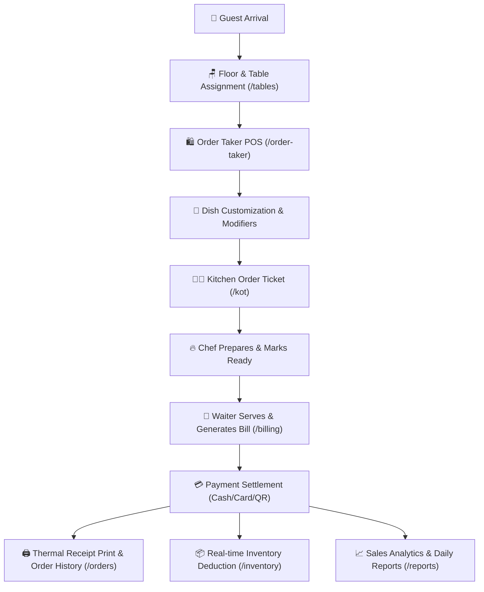

# 🍽️ Smart POS — Café & Restaurant Management System

An enterprise-grade, high-performance, and fully responsive **Point of Sale (POS) & Restaurant Management System** built with **React, Vite, Tailwind CSS v4, and Recharts**.

Designed specifically for fast-casual cafés, fine-dining restaurants, cloud kitchens, and franchises to streamline table bookings, live kitchen order tickets (KOT), itemized billing, inventory deductions, staff rosters, and business intelligence analytics.

---

## 🚀 Key Technology Stack

* **Frontend Library**: React (SPA with React Router v7)
* **Build Tooling**: Vite (Superfast HMR & optimized production bundling)
* **Styling Framework**: Tailwind CSS v4 (Design tokens & CSS variables)
* **Data Visualization**: Recharts (`AreaChart`, `BarChart`, `PieChart`, `ResponsiveContainer`)
* **Iconography**: Lucide React
* **Typography**: Poppins (Unified design system font)

---

## 🔄 End-to-End Restaurant Operational Flow

The system orchestrates the complete real-world lifecycle of restaurant operations from guest arrival to end-of-day revenue reconciliation:



---

### 1️⃣ Step 1: Table & Floor Management (`/tables`)
* **Floor Plan Switching**: Waiters can view tables segmented by floor zones (*Main Hall, Outdoor Patio, VIP Lounge, Upstairs Hall*).
* **Live Occupancy Status**: Color-coded table cards indicating **Available** *(Green)*, **Occupied** *(Red)*, **Reserved** *(Yellow)*, and **Cleaning** *(Blue)*.
* **Instant Seating**: Clicking an available table launches the POS Order Taker with pre-filled guest and table metadata.

### 2️⃣ Step 2: Order Taking & Modifiers (`/order-taker`)
* **Category Navigation**: Fast filtering across Burgers, Pizza, Sides, Beverages, Coffee, and Desserts.
* **Smart POS Cart**: Real-time pricing calculations, quantity increments, 5% automated sales tax (GST), discounts, and subtotal.
* **Modifier Customization**: Modal popup for choosing portion sizes (*Single, Double, Large*), extra cheese, crust options, dips, and special chef instructions.
* **Send to Kitchen**: Submitting an order dispatches a live ticket to the kitchen station.

### 3️⃣ Step 3: Kitchen Display System / KOT (`/kot`)
* **Chef Station Queue**: Live ticket queue displaying Order #, Table #, elapsed time counter, items, quantities, and modifier notes.
* **Ticket Status Transitions**: Orders advance seamlessly through **New** ➔ **Preparing** ➔ **Ready** ➔ **Served**.
* **Audio Alerts & Priority**: Urgent tickets highlighted with distinct visual tags.

### 4️⃣ Step 4: Billing, Discounts & Split Checks (`/billing`)
* **Live Check Review**: Cashiers review occupied table orders with itemized breakdowns.
* **Discount Engine**: Apply custom percentage discounts or voucher codes.
* **Split Bill Engine (`/billing` ➔ Split Check)**:
  * **Split Equally**: Divide grand total evenly among *N* guests.
  * **Split by Items**: Assign individual dishes to specific guest seats.

### 5️⃣ Step 5: Payment Processing (`/billing` ➔ Payment)
* **Cash Tender Calculator**: Quick cash denominations (*Rs. 500, 1000, 5000*) with instant live change return calculation.
* **Digital Terminals**: Debit/Credit card terminal reference input.
* **Mobile QR / Bank Transfer**: Dynamic QR code display for contactless digital banking.
* **Checkout Success**: Triggers receipt generation and updates table status to "Cleaning/Available".

### 6️⃣ Step 6: Order History & Receipts (`/orders`)
* **Search & Audit**: Filter historical orders by Order ID, Customer Name, Date Range, Status (*Completed, Cancelled, Refunded*), and Payment Channel.
* **Thermal Receipt Preview**: Print 80mm/58mm thermal receipts directly via `window.print()`.
* **Reorder Items**: Re-populate dishes into the POS cart with a single click.

### 7️⃣ Step 7: Inventory & Stock Tracking (`/inventory`)
* **Automated Stock Deductions**: Deducts raw ingredients and packaged beverages upon order settlement.
* **Stock Adjustments**: Restock and wastage adjustment modal with live stock variance indicators.
* **Low Stock Alerts**: Highlights items breaching safety re-order levels to prevent kitchen stockouts.

### 8️⃣ Step 8: Reports & Business Intelligence (`/reports`)
* **Executive Summary**: Gross Sales, Net Profit, Discounts, Taxes, Average Order Value (AOV), and Guest counts.
* **Interactive Recharts Visuals**:
  * **Daily Sales & Profit Area Trend**: Trajectory curve with gradient fill and custom dark hover tooltips.
  * **Category Contribution Donut**: Sales volume shares across Burgers, Pizzas, Drinks, and Desserts.
  * **Peak Rush Multi-Bar Chart**: Hourly order volume analysis across Dine In, Takeaway, and Delivery.
  * **Payment Reconciliation Chart**: Cash vs Card vs QR daily intake breakdown.
  * **Staff Sales Leaderboard**: Waiter sales rankings, fulfillment turnaround speeds, and guest star ratings.

---

## 📁 Project Folder Structure

```text
src/
├── assets/
│   ├── fonts/                  # Poppins TTF font files (Regular, Medium, SemiBold, Bold)
│   └── images/                 # App icons and graphics
│
├── components/
│   ├── ui/                     # Core reusable UI primitives
│   │   ├── Button.jsx          # Primary, secondary, outline, danger button styles
│   │   ├── Input.jsx           # Form inputs with validation error states
│   │   ├── Modal.jsx           # Responsive dialog modal with backdrop blur
│   │   ├── Dropdown.jsx        # Select dropdowns
│   │   ├── Table.jsx           # Generic table container
│   │   ├── Badge.jsx           # Semantic status pills (success, warning, danger, purple, primary)
│   │   └── Loader.jsx          # Spinner loader animation
│   │
│   ├── layout/                 # Structural application wrappers
│   │   ├── Sidebar.jsx         # Responsive sidebar with drawer navigation on mobile
│   │   ├── Header.jsx          # Top navbar with search, time display, and notifications
│   │   ├── PageHeader.jsx      # Standardized title & breadcrumb header
│   │   └── MainLayout.jsx      # Root layout wrapper with Outlet
│   │
│   └── common/                 # Shared business domain components
│       ├── SearchBar.jsx       # Universal search bar input
│       ├── ConfirmModal.jsx    # Delete and action confirmation dialog
│       ├── EmptyState.jsx      # Fallback UI for zero records
│       └── Pagination.jsx      # Paginated table navigation
│
├── data/                       # Centralized local mock datasets
│   ├── menu.js                 # Food dishes, categories, pricing, and modifier options
│   ├── inventory.js            # Raw ingredients, current stock, and safety thresholds
│   ├── customers.js            # Customer profiles, VIP loyalty tiers, and past order records
│   ├── staff.js                # Employee roster, roles, shifts, and salaries
│   ├── reports.js              # Daily sales trends, hourly rush, and payment analytics
│   └── orders.js               # Historical completed/cancelled orders and item breakdowns
│
├── pages/                      # Application route views (12 modules)
│   ├── auth/
│   │   └── Login.jsx           # Staff/Admin authentication portal
│   │
│   ├── dashboard/
│   │   └── Dashboard.jsx       # Overview KPI metrics & live operational summary
│   │
│   ├── order-taker/
│   │   ├── OrderTaker.jsx      # Main POS cash register screen
│   │   ├── CategorySidebar.jsx # Food category filters
│   │   ├── ProductGrid.jsx     # Food dish item cards
│   │   ├── CurrentOrder.jsx    # Active order cart sidebar
│   │   └── ModifierModal.jsx   # Portion size & topping customizations
│   │
│   ├── tables/
│   │   ├── Tables.jsx          # Restaurant floor plan & table overview
│   │   ├── TableCard.jsx       # Individual table status card
│   │   └── TableDetails.jsx    # Table guest metadata & occupied order summary
│   │
│   ├── kitchen/
│   │   ├── KOT.jsx             # Kitchen Display System (KDS) board
│   │   └── KOTCard.jsx         # Individual chef order ticket
│   │
│   ├── billing/
│   │   ├── Billing.jsx         # Invoice calculation & order settlement
│   │   ├── Payment.jsx         # Cash, card, and online payment checkout
│   │   └── SplitBill.jsx       # Bill splitting by equal split or item assignments
│   │
│   ├── menu/
│   │   ├── Menu.jsx            # Food menu catalog & availability switch
│   │   ├── AddMenuItem.jsx     # New dish registration form
│   │   ├── EditMenuItem.jsx    # Dish pricing and details update form
│   │   ├── Categories.jsx      # Category creation and ordering
│   │   └── Modifiers.jsx       # Add-ons, portion sizes, and dips
│   │
│   ├── inventory/
│   │   ├── Inventory.jsx       # Inventory tabs container
│   │   ├── Stock.jsx           # Raw material stock ledger & adjustment modal
│   │   ├── Purchases.jsx       # Vendor procurement invoices
│   │   └── LowStock.jsx        # Critical threshold alerts
│   │
│   ├── customers/
│   │   ├── Customers.jsx       # Guest directory, VIP tiers, and dual-view table
│   │   └── CustomerDetails.jsx # Profile overview, loyalty points, and order history
│   │
│   ├── reports/
│   │   ├── Reports.jsx         # Reports Dashboard with Recharts revenue curves
│   │   ├── SalesReport.jsx     # Itemized sales & tax audit with multi-filters
│   │   ├── OrderReport.jsx     # Peak rush hours & dining channel donut chart
│   │   ├── PaymentReport.jsx   # Cash drawer & digital terminal audit
│   │   └── StaffReport.jsx     # Waiter sales leaderboard & turnaround speeds
│   │
│   ├── staff/
│   │   ├── Staff.jsx           # Staff management & duty toggle switch
│   │   ├── AddStaff.jsx        # Employee onboarding modal
│   │   └── EditStaff.jsx       # Role & shift update modal
│   │
│   ├── orders/
│   │   ├── Orders.jsx          # Orders wrapper
│   │   ├── OrderHistory.jsx    # Order history table with search & filters
│   │   └── OrderDetails.jsx    # Full receipt breakdown modal
│   │
│   ├── profile/
│   │   └── Profile.jsx         # User account info, security & password reset
│   │
│   └── settings/
│       └── Settings.jsx        # Multi-tab settings (General, KOT, Tax, Appearance, Security)
│
├── App.jsx                     # Master React Router v7 configuration
├── main.jsx                    # React root entry point
└── index.css                   # Tailwind CSS v4 design tokens & theme variables
```

---

## 📱 Mobile-First Responsive Design Pattern

The UI implements a specialized **Dual-View Architecture** ensuring seamless usability across phones, tablets, POS terminals, and large displays:

* **Desktop Mode (`hidden md:block`)**: High-density data tables with fixed headers, sticky columns, and horizontal scroll containment (`overflow-x-auto min-w-[750px]`).
* **Mobile Mode (`block md:hidden`)**: Data tables automatically convert into touch-optimized **Mobile Cards** with avatar circles, quick action buttons, and clear typography hierarchy.
* **Touch-Friendly Controls**: Modals fit within mobile viewports (`max-h-[85vh] overflow-y-auto`), and category bars convert into **horizontal swipeable pill rows** for effortless single-hand POS operation.

---

## 🛠️ Installation & Setup

### Prerequisites
* **Node.js**: v18.0.0 or higher
* **npm**: v9.0.0 or higher

### 1. Clone & Install Dependencies
```bash
git clone <repository-url>
cd Restaurant-POS/frontend
npm install
```

### 2. Run Local Development Server
```bash
npm run dev
```
Open your browser and navigate to `http://localhost:5173`.

### 3. Production Build
```bash
npm run build
```
Generates a minified, production-ready bundle in the `dist/` directory.

---

## 🎨 Theme Tokens & Color Palette

All colors adhere strictly to the CSS custom properties defined in `src/index.css`:

| Token | CSS Variable | Hex Color | Usage |
| :--- | :--- | :--- | :--- |
| **Primary** | `--color-primary` | `#2563eb` | Primary buttons, active tabs, brand accents |
| **Sidebar BG** | `--color-bg-sidebar` | `#0f172a` | Dark slate navigation sidebar |
| **Main BG** | `--color-bg-main` | `#f8fafc` | Clean light gray background |
| **Card BG** | `--color-bg-card` | `#ffffff` | Elevated surface cards & modals |
| **Success** | `--color-success` | `#16a34a` | Completed orders, available tables, revenue |
| **Warning** | `--color-warning` | `#f59e0b` | Reserved tables, pending KOT tickets |
| **Danger** | `--color-danger` | `#dc2626` | Occupied tables, cancelled orders, discounts |
| **Purple** | `--color-purple` | `#8b5cf6` | VIP customer tier, admin roles, online QR |
| **Orange** | `--color-orange` | `#f97316` | Best seller badges, pizza category |

---

## 📄 License
This project is licensed under the **MIT License**.
